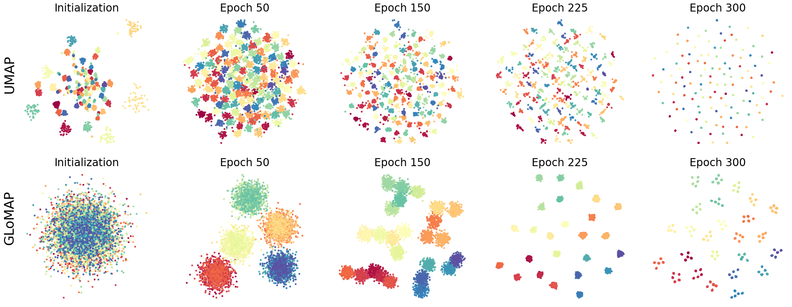
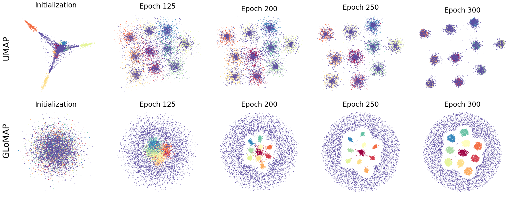
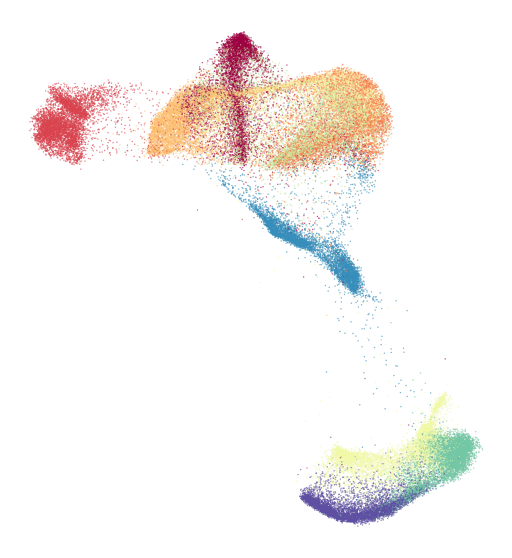
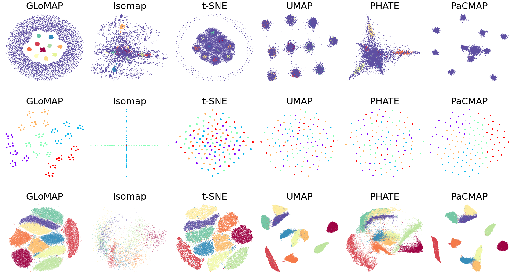

# iGLoMAP: Inductive Global and Local Manifold Approximation and Projection

[](https://arxiv.org/abs/2406.08097)
[](https://openreview.net/forum?id=p9pxeNupQ5)
[](LICENSE)

## Overview

iGLoMAP is a novel manifold learning method for nonlinear dimensionality reduction and visualization. Unlike existing methods (t-SNE, UMAP) that typically emphasize local structure, **iGLoMAP preserves both global and local distance relationships** while displaying a **unique gradual transition from global to local structure during optimization** - a behavior not observed in other methods.

The paper introduces two algorithms:
- **GLoMAP**: Transductive version for manifold learning
- **iGLoMAP**: Inductive version using deep neural networks for generalization to unseen data

## Visual Results

### The unique gradual progression from global shape to local detail

The key innovation is the **progression from global to local structure** - notice how UMAP remains scattered while GLoMAP smoothly transitions:


*Figure 1: Hierarchical dataset showing UMAP (top) vs GLoMAP (bottom). GLoMAP exhibits unique progression from global (forming spheres) to local structure.*

### Additional Examples


*Figure 2: Spheres dataset - demonstrating GLoMAP's gradual formation from global to local clusters.*


*Figure 3: iGLoMAP on the Fashion MNIST dataset (Xiao et al., 2017) showing clear separation and structure preservation.*

### Method Comparison on Real Data


*Figure 4: MNIST visualization comparing GLoMAP with t-SNE, UMAP, Isomap, PHATE, and PaCMAP. GLoMAP maintains both global and local structure better.*

## Key Features

### 🌍 Global & Local Balance
- Captures both global and local structure of high-dimensional data
- Uses shortest-path distances (Dijkstra's algorithm) for global structure
- Employs k-nearest neighbor distances for local structure

### 📊 Gradual Transfer Behavior
The optimization exhibits a **unique progression from global to local detail formation** (see Figure 1 in the paper):
- Early epochs: Global structure dominates
- Progressive epochs: Smooth transition to local details
- **This behavior is unseen in t-SNE/UMAP and provides intuitive, interpretable results**

### 🔄 Inductive Generalization
- Extends to inductive learning through deep neural networks
- Generalizes to unseen data without retraining
- Particle-based algorithm for stable training with encoder

### 📈 Theoretical Grounding
- Consistent local geodesic distance estimator
- Unbiased loss estimator enabling UMAP-style algorithms on non-sparse global distance matrices
- Theoretical justification for the tempering mechanism

## Installation

### Prerequisites
- Python 3.7+
- pip or conda

### Option 1: Basic Installation (Recommended)

```bash
# Clone the repository
git clone https://github.com/JungeumKim/iGLoMAP.git
cd iGLoMAP

# Install dependencies
pip install -r requirements.txt

# Install the package in editable mode
pip install -e .
```

### Option 2: Conda Installation (if using conda)

```bash
conda create -n glomap python=3.9
conda activate glomap
conda install pytorch torchvision torchaudio -c pytorch
pip install -r requirements.txt
pip install -e .
```

### Verification

Test the installation:
```python
from iglo.manifold import glomap
from iglo._data import get_dataset
print("iGLoMAP installed successfully!")
```

## Quick Start

### Transductive Learning (GLoMAP)
See `Transductive_examples.ipynb` for complete examples on various datasets:

```python
from iglo._data import get_dataset
from iglo.manifold import glomap

# Load hierarchical dataset
X, Y = get_dataset("hier", 6000)

# Create and fit the reducer
reducer = glomap.iGLoMAP(
    n_neighbors=250,
    plot_freq=50,
    use_mapper=False,
    save_vis=True
)

# Fit and transform
p = reducer.fit_transform(X, Y)  # Y is for visualization coloring only
```

### Inductive Learning (iGLoMAP)
See `Inductive_examples.ipynb` for training with neural network mapper:

```python
from iglo._data import get_dataset
from iglo.manifold import glomap

# Load dataset
X, Y = get_dataset("spheres", 6000)

# Create reducer with inductive learning
reducer = glomap.iGLoMAP(
    EPOCHS=5,
    plot_freq=50,
    save_vis=True
)

# Fit on training data
p = reducer.fit_transform(X, Y)

# For new data, use the trained encoder
X_new = ...
p_new = reducer.transform(X_new)
```

## Datasets Supported

The method has been tested on:
- **Synthetic datasets**: Hierarchical, Spheres, S-curve, Severed sphere, Eggs
- **Real datasets**: Fashion-MNIST (supports additional datasets)

Examples for each dataset are provided in the Jupyter notebooks.

## Comparison with State-of-the-art

iGLoMAP shows competitive or superior performance compared to:
- **t-SNE**: Emphasizes local structure; lacks global structure preservation
- **UMAP**: Better global structure but less local detail
- **Snekhorn**: Recent method, but no gradual transfer behavior

See **Figure 2** in the paper for visual comparisons on synthetic and real datasets.

## Performance Characteristics

| Aspect | GLoMAP | iGLoMAP |
|--------|--------|--------|
| Global Structure | ✅ Excellent | ✅ Excellent |
| Local Structure | ✅ Excellent | ✅ Excellent |
| Gradual Transfer | ✅ Yes | ✅ Yes |
| Generalization | ⚠️ Limited | ✅ Full |
| Scalability | ⚠️ Python only | ⚠️ Python only* |
| New Data Support | ❌ No | ✅ Yes |

*Current implementation in pure Python. Performance can be improved with Numba/Cython/C++ optimization.

## Citation

If you use iGLoMAP in your research, please cite:

```bibtex
@article{kim2024glomap,
  title={Inductive Global and Local Manifold Approximation and Projection},
  author={Kim, Jungeum and Wang, Xiao},
  journal={Transactions on Machine Learning Research},
  year={2024}
}
```

## References

- **Paper**: [OpenReview](https://openreview.net/forum?id=p9pxeNupQ5) | [arXiv](https://arxiv.org/abs/2406.08097)
- **Code**: [GitHub](https://github.com/JungeumKim/iGLoMAP)

## Key Insights from Reviewers

The paper was accepted to TMLR with all reviewers recommending acceptance. Key strengths highlighted:

1. **Novel gradual transfer behavior**: "The progression from global to local structure during optimization provides intuitive and interpretable results" - Reviewer X2sp

2. **Balanced structure preservation**: "The paper addresses a key issue in manifold learning: capturing both global and local structures. This balance is often lost in methods like t-SNE and UMAP" - Reviewer X2sp

3. **Theoretical rigor**: "The theory and discussion are elegant and give a nice interpretation for the design of the algorithm" - Reviewer yBN5

4. **Practical scalability**: iGLoMAP enables miniature-batch learning and generalization to new data without retraining.

## Notebooks

- **[Transductive_examples.ipynb](./Transductive_examples.ipynb)**: Demonstrates GLoMAP on various datasets with visual progression
- **[Inductive_examples.ipynb](./Inductive_examples.ipynb)**: Shows iGLoMAP with deep neural network training and generalization

## License

This project is licensed under the CC BY 4.0 License - see the [LICENSE](LICENSE) file for details.

## Contact & Discussion

For questions, suggestions, or discussions about the method, please open an issue on GitHub or refer to the OpenReview forum. 
